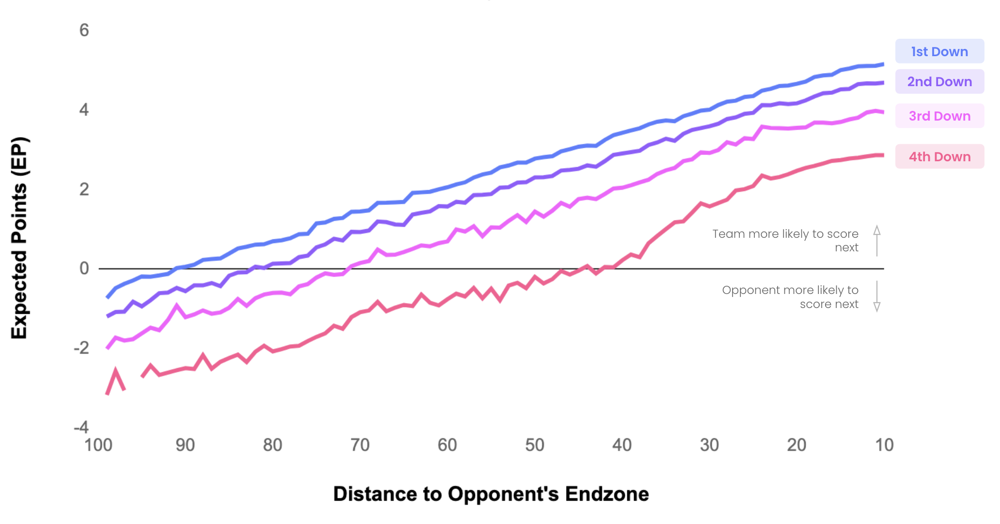
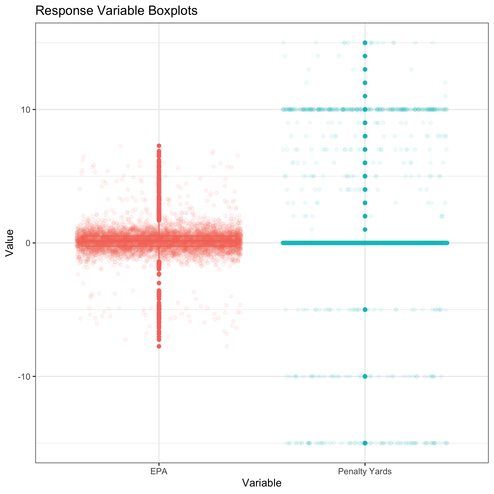
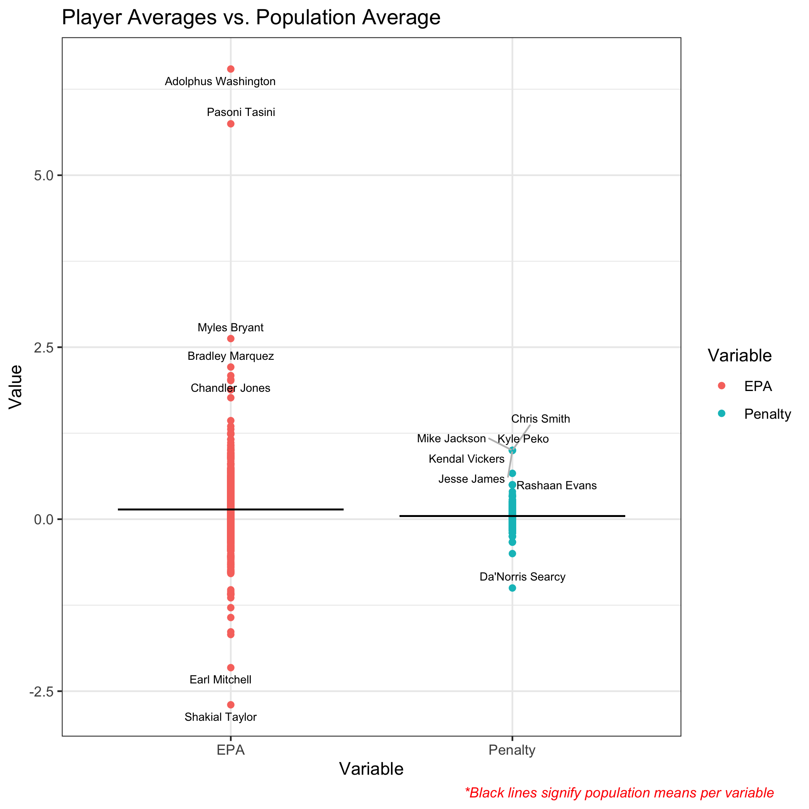

```{r setup, include=FALSE}
knitr::opts_chunk$set(echo = TRUE)
```

```{r, include=F}
library(knitr)
library(tidyverse)
library(Matrix)
library(gt)
library(gtExtras)
#we need to load in our dataframe to use for a few things this will be hidden though

Sparse.Df <- readMM("Derived_Data/Sparse.Matrix.txt")

punts <- read_csv("Derived_Data/clean.plays.csv")

player.index <- read_csv("Derived_Data/player.index.csv")

#first lets attach the unique newIds to the Sparse.Df as it's own column

#we need to convert the sparse matrix into a large data frame

Sparse.tib <- as.data.frame(as.matrix(Sparse.Df))

#now we can figure out which column corresponds to which player with the player.index

col.names <- player.index %>%
    arrange(ColIdx) %>%
    distinct(nflId, ColIdx) %>%
    select(nflId)

names(Sparse.tib) <- as.character(unlist(col.names))

Sparse.tib.named <- Sparse.tib %>% 
  mutate(newId = punts$newId) %>% 
  mutate(Pen.Yrds = punts$penalty.yards.clean) %>% 
  #here we use negative EPA since EPA is from the possession team perspective and I switched the variable of success 
  #to be from the return team perspective (-1 punters, 1 returners)
  mutate(EPA = -punts$epa) %>% 
  select(newId, EPA, Pen.Yrds, everything())
```


\pagebreak

\doublespacing

1. Abstract
-----------

In this paper, I discuss the creation of two new metrics designed to assess individual player contribution during punting plays in the NFL. Regularized Adjusted Expected Points Added Contribution (RAEPAC) and Regularized Adjusted Penalty Contribution (RAPC) allow for comparisons between players of any position on the punt or return team. The purpose of developing these metrics is to help general managers and coaches decide what personnel should be on the field for a given punt play. They can also be used to rank players and teams on their effectiveness during special teams. I use tracking data from 2018-2020 from the NFL's Big Data Bowl along with methodology taken from Dan Rosenbaum's creation of the Adjusted Plus-Minus metric in the NBA to build these new metrics. I use two types of regression techniques to model the two response variables: Expected Points Added (EPA) and an indicator for penalties. The regression methods are Ridge Regression and Regularized Ordinal Logistic Regression and I use the regression coefficients to define RAEPAC and RAPC respectively. I find that John Cominksy, a defensive tackle for the Atlanta Falcons, has the highest RAEPAC meaning he contributes the most towards the team's success during punts plays. Also, I find that the Atlanta Falcons have the highest overall player average RAEPAC meaning they are the most successful at maximizing EPA during punt plays. On the other hand, I find that RAPC is flawed and often attributes penalty contribution to players that historically do not cause penalties, like return men and punters. I conclude that RAEPAC is the better metric for assessing effectiveness during punt plays and can be used to rank players in how much they contribute towards their team's success. 

2. Introduction
---------------

This paper introduces two new metrics for evaluating player performance during punting situations in the NFL: Regularized Adjusted Expected Points Added Contribution (RAEPAC) and Regularized Adjusted Penalty Contribution (RAPC). To build these new metrics, I adapt a statistic historically used in the NBA called Adjusted Plus-Minus (APM). This metric adjusts the conventional Plus-Minus metric to control for every player on the court during a stint where the same 10 players are on the court. Conventional Plus-Minus is used to quantify an individual player's impact and is defined by the difference between their team's total scoring versus their opponent's while that player is in the game. 
In classic APM for basketball, the variable of interest is the points scored during the stint, however this will not work for football since points are rarely scored during punts. In RAEPAC, I use Expected Points Added (EPA) as the variable of interest, while in RAPC I use a penalty indicator that describes which team was penalized. EPA is calculated by taking the difference between the Expected Points before and after the play. Expected Points relates each play to how much it changes the chances of scoring on that drive. EPA is commonly used as a metric that defines how successful a given play is, thus it is the perfect response variable. EPA calculation is explained in more detail in Section 3.1 of the Methodology.

Specifically, to calculate RAEPAC I use Ridge regression with EPA as the response and indicators for when each player is on the field as the predictors to identify coefficients for each player. To calculate RAPC, I use a Regularized Ordinal Logistic Regression with the penalty indicator as the response to calculate coefficients for each player. The regression coefficients for the respective models are what define these two new metrics. 

These metrics can be used to rank players regardless of their position on how much they positively contribute towards the success of their team in punting situations. This type of evaluation method could be extremely useful for coaches when deciding who should be on the field during crucial punting plays. Also, these metrics can be aggregated at a team level to rank how successful teams are during punts. Assessing players regardless of their position could change the way coaches think about their personnel and shed light on players that may not get enough credit for their contribution. It can also force decision makers to ask why certain players score highly in this metric and determine what is innate and what is coachable which could help during player development. 

**2.1 Data**

The final dataframe used for analysis has 5890 plays with 2005 unique players on 32 teams and two response variables: EPA and the penalty indicator. Each row is a play from 2018-2020 where the team lined up to punt the ball and each column is a player that could have been on the field. Each cell of the dataframe represents if the player was on the field during that play or not. A player on the punting team is given a `-1` and each player on the receiving team is given a `1`. Players that were not on the field during a punt are coded as a `0`. This follows the methodology first employed by Dan Rosenbaum for computing APM in basketball (Rosenbaum 2004). 

This dataframe is inherently rank deficient, therefore, I cannot use standard linear regression. The dataframe is rank deficient because if I remove a players column, I still know whether he was on the field on offense or defense by simply using the rest of the columns. Accordingly, the matrix does not have full rank. In other words, the rank of the matrix will always be at most N-1 given there are N players represented. Because of the rank deficiency, I need to use a penalized approach during the regression procedures. Below is a glimpse of the dataframe.

\pagebreak

```{r, echo = F}
head(Sparse.tib.named %>% 
       rename(PlayId = newId, 
              Penalty = Pen.Yrds) %>% 
       select(1:10)) %>% 
  gt()
```


3. Methodology
--------------

In this section I discuss the EPA variable calculation, Exploratory Data Analysis (EDA), and the model selection process. I use a similar methodology as explained in Dan Rosenbaum's 2004 paper, titled "Measuring How NBA Players Help Their Teams Win", where he describes the creation of the APM model (Rosenbaum 2004). 

**3.1 EPA Calculation**

EPA is calculated by taking the difference between the Expected Points before and after the play occurs. Using historical data, the amount of points a team is expected to score on the current drive can be calculated as a function of the down, distance to the first down, and field position. Expected Points is based off the notion that not all yards gained are the same. For example, a 2-yard gain on 4th and 3 does not increase a teams chance of scoring, while a 2-yard gain on 4th and 1 does because the offense will remain on the field. Figure 1 shows how Expected Points changes as a team drives down the field towards the opponents end zone (Greer 2021). 

```{r, echo = F, out.height = "35%", fig.cap = "This plot shows how Expected Points changes depending on the down and distance to the end zone. As shown, it is far better to be closer to the end zone on early downs.", fig.pos = "H", fig.show='hold', fig.align='center'}

```

Expected Points increases as the team moves closer to the end zone. Also, the down has a significant impact on the Expected Points as 1st down will always be higher than 4th because 4th down is the team's last opportunity to get a first down or score. When Expected Points is negative, this means the opponent is more likely to score on the next drive because the team currently in possession is likely to punt. This situation occurs when a team is near their own end zone. EPA shows how much the Expected Points changed because of the play that happened. When EPA is positive, the play is deemed successful for the offense. I'll use EPA, calculated by the nflfastR play-by-play database, as my main response variable because it directly reflects the success of the play in terms of Expected Points scored in the current drive. The punting team will want this variable to be as negative as possible, while the return team will try to increase it. 

**3.2 Exploratory Data Analysis**

I complete a preliminary EDA to validate and visualize the data before the modeling procedures. Completing an EDA prior to modeling is a crucial step that ensures the data are correct and the model choices are valid. To validate the dataframe, I first check that each row sums to zero to show there are the same number of offensive and defensive players on the field. I then check that there are always 22 players on the field. Finally, I choose 500 random plays and check to make sure the correct players are on the field.

Next, I visualize the response variables: EPA and Penalties. This step helps to decide what kind of models are appropriate for these responses. Below I plot the histograms of the two variables. 

```{r, echo = F, out.height = "45%", fig.cap = "This plot shows the distribution of the two response variables. It seems the EPA response is approximately normal around zero with a few outliers on the tails. On the other hand there are a lot of plays with no penalties.", fig.pos = "H", fig.show='hold', fig.align='center'}
knitr::include_graphics("EDA_Plots/01_Response_Histograms.png")
```

Figure 2 shows an inflated number of zeros in penalty indicator. Penalties is a categorical variable and there are many plays that do not have penalties and thus have a value of zero. Regression will likely be very difficult with this extreme class imbalance. On the other hand, EPA is a continuous variable and many of the values are close to zero, indicating that the punt leads to neither team gaining an advantage. There seem to be a few outliers in the EPA response, these are the plays that were extremely successful for either the punt or return team. Punts that result in a fumble and the punting team recovering the ball result in a very negative EPA close to -7 meaning the punting team is now likely to score. Similarly, punts that result in a huge return have a high EPA close to 7 that shows the return team was successful. In Figure 3, I show box-plots of the response variables to reinforce these findings. 

```{r, echo = F, out.height = "50%", fig.cap = "These box-plots reinforce what is seen in Figure 2. The mean for both response variables is around zero and EPA seems approximately normal.", fig.pos = "H", fig.show='hold', fig.align='center'}

```

Figure 3 strengthens the observation that EPA is approximately normally distributed around zero and has small tails at 7 and -7. Penalties only takes three categorical values that correspond to the type of penalty committed. A vast majority of plays do not have a penalty and thus have a zero value for this response.

The last visualization I make for the EDA shows a rudimentary look at the impact players have while they are on the field. Figure 4 shows the average EPA and Penalties for each player when they are on the field against the population average for both response variables. This plot helps to explain the intuition behind this analysis, I suspect that players with higher averages also may contribute more. 

```{r, echo = F, out.height = "60%", fig.cap = "This plot shows how individual players averages are different than the population average for both response variables. Labled players are 2 standard deviations away from the population mean.", fig.pos = "H", fig.show='hold', fig.align='center'}

```

In Figure 4, I find players that have skewed averages because they were on the field for very few plays. Adolphus Washington only played one snap on the return team that happened to be a major return, thus resulting in a high EPA. Similarly, Da'Norris Searcy and Kendal Vickers each played a single snap that happened to have a penalty. Because of this, these players with low snap counts will not be considered during the contribution analysis as they have not played enough snaps to truly assess their contribution. During the modeling procedures I set the minimum snap count to 25 meaning a player will need approximately three games on the punt or return team for their contribution to be considered noteworthy. After setting that threshold, 870 players are taking out of consideration as they did not play enough snaps and are likely not regular members of the special teams leaving 1135 players to be considered. These 1135 players are the ones we truly care about as they regularly play on the punt or return team. 

**3.3 Model Selection**

The model selection process follows directly from the results for the EDA. I attempt to use models that are appropriate for the distribution and real world interpretation of the two response variables. In each case, the regression coefficient for each player will represent their individual contribution controlling for all other players on the field during that play. 

*EPA Model:* The player interaction matrix is rank deficient and thus I must use a penalized approach to the regression. Adding the penalty term ensures the player interaction matrix is invertible. EPA is approximately normal around zero and continuous, so it is rational to use Ridge regression to account for the rank deficiency and still find reasonable coefficients for each player to represent their contribution. I decide to use Ridge here rather than LASSO because I do not want any player to end up with zero as their contribution. If I had used LASSO, many of the player's regression coefficients would likely be shrunk to zero and I would not be able to rank them. This penalized approach also controls for any multicollinearity that may occur in the player matrix. Many players, such as punters and long snappers, are likely always together on the field for the same plays which may introduce multicollinearity that would inflate coefficient values. I use 10-fold cross validation to find the optimal penalty parameter. The best model from these cross validation procedures is used to find the EPA contribution for each player. 

*Penalty Model:* This response is a three factor ordinal categorical variable. Like in the EPA model formulation, I need to use a penalized approach since the player interaction matrix is rank deficient. Thus, I decide to use a Regularized Ordinal Logistic Regression. This regression technique works as a classification model when the response has three or more categories. I use an Ordinal Logistic Regression because in this case the order of my response matters. For this response, I use a LASSO penalty because I do not need to rank those players that do not significantly contribute towards penalties. In the EPA model I assess how each player contributes to EPA since every play has a measured EPA, but in this case I only care about those players that actually contribute to the penalties. With a LASSO penalty, players on the field during plays that did not have a penalty will have a contribution of 0. I use 10-fold cross validation here to find the optimal penalty parameter. The model with the highest out of sample classification accuracy is used to find each player's penalty contribution. 

The major class imbalance in the penalty response will likely cause problems during the regression modeling. The model will likely have high accuracy by simply predicting there will not be a penalty on each play. To remedy this, I attempt to use a Random Over-Sampling Example process called ROSE that will try to balance the three classes during the cross validation procedure. ROSE generates synthetic samples where the response is more balanced to try and train the model in a more robust fashion. 

4. Results & Discussion
-----------------------

In this section I discuss the results from the two regression analyses. I present the result at the player level as well as the aggregated team level to assess both individual player and team effectiveness during punt plays. 

**4.1 Player Level Analysis**

First, I discuss results on the individual player level for both RAEPAC and RAPC. Here I assess how each player contributed towards EPA and Penalties independent of the other players that were on the field with them during a stint. Figure 5 shows the top 10 and bottom 10 players for the RAEPAC metric. 

```{r, echo = F, out.height = "50%", fig.cap = "This figure shows the top 10 and bottom 10 players with regard to EPA contribution. The bottom 10 players are those with negative contribution with Arik Armstead being the worst.", fig.pos = "H", fig.show='hold', fig.align='center'}
knitr::include_graphics("Regression_Plots/top20_EPA_gt.png")
```

The top 10 players contribute positively towards EPA meaning they contribute efficiently and help their team succeed. On the other hand, players in the bottom 10 contribute negatively meaning their opponent is more successful during the punt return. Players in the bottom 10 effectively detract from their team's success. Because of the regularization technique, these contribution metrics cannot be interpreted in the same way as in ordinary least squares regression coefficients. Instead, they must be interpreted as the amount of differential contribution with respect to the penalty parameter. In other words, the contribution is an approximation scaled by the penalty parameter. 

Notably, no position is specifically better than any other. Usually, the ball carrier gets most of the credit during a punt return, but this metric does not discriminate against position and attempts to highlight those players that normally get little to no credit during returns. Based on outside knowledge of the NFL, a player's position on offense or defense does not seem to matter either, both sides of the ball seem to be represented in the top and bottom 10. WR, RB, and TE are all offensive positions while DE, DT, and OLB are defensive positions, but they are all represented. Also, snap count does not seem to have a major impact on contribution. Players that are on the field more (or less) do not seem to have better (or worse) contribution. 

Figure 6 shows a similar plot for the RAPC metric. In this case, I only plot the top 20 players because decision makers will want to know the players that contribute most towards penalties. For this metric, positive contribution means the player contributes towards penalties that hurt their own team. In other words, positive contribution is bad unlike in RAEPAC where positive contribution means they contribute towards success.

```{r, echo = F, out.height = "50%", fig.cap = "This figure shows the top 20 players in penalty contribution. These players detract from team success as positive contribution means the penalties hurt their team.", fig.pos = "H", fig.show='hold', fig.align='center'}
knitr::include_graphics("Regression_Plots/top20_Penalty_gt.png")
```

Like in EPA contribution, Figure 6 shows that player position does not seem to be a contributing factor. This makes perfect sense as any position can cause penalties. Though, there are a few punters here. I assume these players are not the ones causing the penalties as punters rarely are penalized. Rather, they are simply on the field when penalties happen. Similarly, there are a few players (James Proche & Ray-Ray McCloud) that are the primary return men for their respective teams. It is usually unlikely that the ball carrier will be penalized so they are likely just on the field when their team is getting penalized, thus the penalty contribution is attributed to them. This discovery points to a flaw in the player level penalty analysis. Players that are likely not getting penalized are being shown as high penalty contributors because they are on the field the most during stints when penalties occur. Because of this flaw, it is difficult to say if looking at penalty contribution on the player level is useful or not since the contribution statistic may be misleading. Rather than attributing these penalties to specific players, I'll move on to aggregate on a team level to assess which teams have high penalty contribution. 

**4.2 Team Level Analysis**

To rank team's effectiveness during punt returns I now aggregate RAEPAC and RAPC on the team level for players that were on the field for 25 or more snaps. To do this, I take the average contribution for each team. Since there are about 60-70 players and very few outliers for each team an average seems appropriate to measure total team effectiveness. A few of these players have changed teams during this three year time period, so to remedy this I scale their contribution by the percentage of snaps they played for each team. I call this the Adjusted Contribution. Figure 7 shows the average RAEPAC for each team. 

```{r, echo = F, out.height = "50%", fig.cap = "This plot shows the average EPA contribution for each team. Clearly, the Falcons and the Saints are the most effective teams during punt situations, and the Rams are the least.", fig.pos = "H", fig.show='hold', fig.align='center'}
knitr::include_graphics("Regression_Plots/Team_EPA_Contribution.png")
```

Figure 7 shows us how effective an entire team is during punting situations. It seems the Falcons and the Saints are the most effective teams during punts. This is interesting because only one player from the Falcons and zero players from the Saints are represented in the top 10 for EPA contribution. It seems that despite not having the highest contributors, the rest of the team has relatively high contribution. This means the team is successful during punts. On the other hand, the most recent Super Bowl champion is the least effective team during punting situations. This could be because the LA Rams lean towards going for it on 4th down.

There also seems to be more teams with a negative average contribution. This is likely because in a normal punting situation with a decent return the punting team will end up with a slightly negative EPA. In most situations punting the ball away will lead to the return team having a positive EPA solely because they are getting the ball back. 

In Figure 8 I plot the average RAPC for each team. Here, positive values mean the team causes penalties while negative values mean the team's opponent is penalized. 

```{r, echo = F, out.height = "50%", fig.cap = "In this plot I show the average RAPC for each team. The Steelers have the highest average by far meaning those players are likely penalized the most.", fig.pos = "H", fig.show='hold', fig.align='center'}
knitr::include_graphics("Regression_Plots/Team_Penalty_Contribution.png")
```

In Figure 8 I show the teams that have the highest average penalty contribution. These teams are penalized the most during punts as either the punting or returning team. Clearly, the Steelers have the highest average. This is interesting as in Figure 6 there are no Steelers players represented in the top 20 for penalty contribution. This must mean that as a whole their team has much higher penalty contribution than others, essentially meaning they are penalized the most. Since this response variable is simply an indicator, it cannot be said that these teams have the most penalty yards, rather they are simply penalized more often. 

The LA Rams have a negative penalty average since in Figure 6 they have two players in the top 20 for penalty contribution. This must mean the teams they play against must be penalized often during punt plays. There are clearly more teams with negative average RAPC, meaning their opponents are penalized more often. Since this model formulation accounts for penalties on both offense and defense it is difficult to say if these teams are penalized more when punting or returning. Historically, more penalties are called on the return team as there are more opportunities to get penalized when your team has the ball, but I cannot say for sure when the penalties are occurring using this model.

5. Conclusion & Future Research
-------------------------------

**5.1 Conclusion**

To conclude, I have found the players that effectively contribute toward the success of their team during punting scenarios. Since these metrics are specific and only designed for special teams plays it is difficult to compare them to other historically used metrics as most statistics in football describe the ball carrier. RAEPAC and RAPC can be used to compare players across different positions that do not carry the ball. Punting plays are pivotal moments in games and designing metrics to assess player's value is crucial. These metrics could be useful when deciding what personnel should be on the field for a given play. Finding players that contribute towards success despite not having direct contact with the ball could be very important for both general managers and coaches. 

It seems RAEPAC is more useful than RAPC on the individual and team level. Because the penalty response has a major class imbalance it is difficult to build a reasonable classification model and assess individual player contribution. Simply, there are not enough penalties during punts in the data. EPA is calculated on every play and accounts for penalties that occur during the play, so it is a more effective metric for assessing success. Also, RAPC does not seem to find players that are truly contributing to the penalties, rather it may be finding the teams that are causing the most penalties. Instead of aggregating this metric over teams, it would be simpler to count how many penalties teams get during these plays and use that metric to assess how teams are penalized during punts. Also, RAEPAC is approximately normally distributed around 0 and is a continuous variable which allows for more common regression techniques. Because of this, it is more easily interpretable. Furthermore, RAEPAC is positive when describing a player that effectively contributes while RAPC is positive when a player detracts from a teams success. This could easily be misinterpreted and could cause confusion as positive numbers are usually an indication of something positive happening. I could easily switch the sign of this metric, but that does nothing to remedy the underlying flaws with the RAPC metric. RAEPAC seems to be a better more easily understood metric that is more robust to changing data and could easily be calculated for plays outside of special teams. 

**5.2 Future Research**

Future work should expand RAEPAC to be calculated for all types of plays and scenarios. EPA is calculated on every single play of a game and therefore RAEPAC can also be calculated. Assessing this metric for an offensive drive could help coaches choose plays for given scenarios as well as choose the personnel. Also, because it assesses contribution on both sides of the ball it could easily be used to find those defensive players that are making an impact and helping their team get the ball back. 

Another feature that could be easily added to this analysis with the correct data would be the comparison between RAEPAC and salary. This information could be extremely useful to general managers as they oversee contract management, trades, and drafting players. Knowing how much a player effectively contributes towards the success of their team could help managers decide how much they should be paid. It could also help them find those players that are being undervalued or overvalued. Billions of dollars are spent on players every year and it is important to know if a general manager is making the right investment. 

Finally, a more complex analysis could include a model that assess overall teams contribution rather than using averages of the individual players. The teams are the overarching group and the players are simply nested within those groups. It could be interesting to see which teams contribute the most towards success and see how players within those teams contribute towards that overall success. 

\pagebreak

6. References
-------------

1. Greer, R. (2021, October 23). What are expected points added (EPA) in the NFL. nflelo. Retrieved March 21, 2022, from https://www.nfeloapp.com/analysis/expected-points-added-epa-nfl 

2. Rosenbaum, D. (2004, April 30). Measuring How NBA Players Help Their Teams Win. Picking the difference makers for the All-NBA Teams. Retrieved March 21, 2022, from http://www.82games.com/comm30.htm 

\pagebreak

7. Appendix
-----------

A full appendix can be found on github here: https://github.com/mattymo18/2022-NFL-Big-Data-Bowl