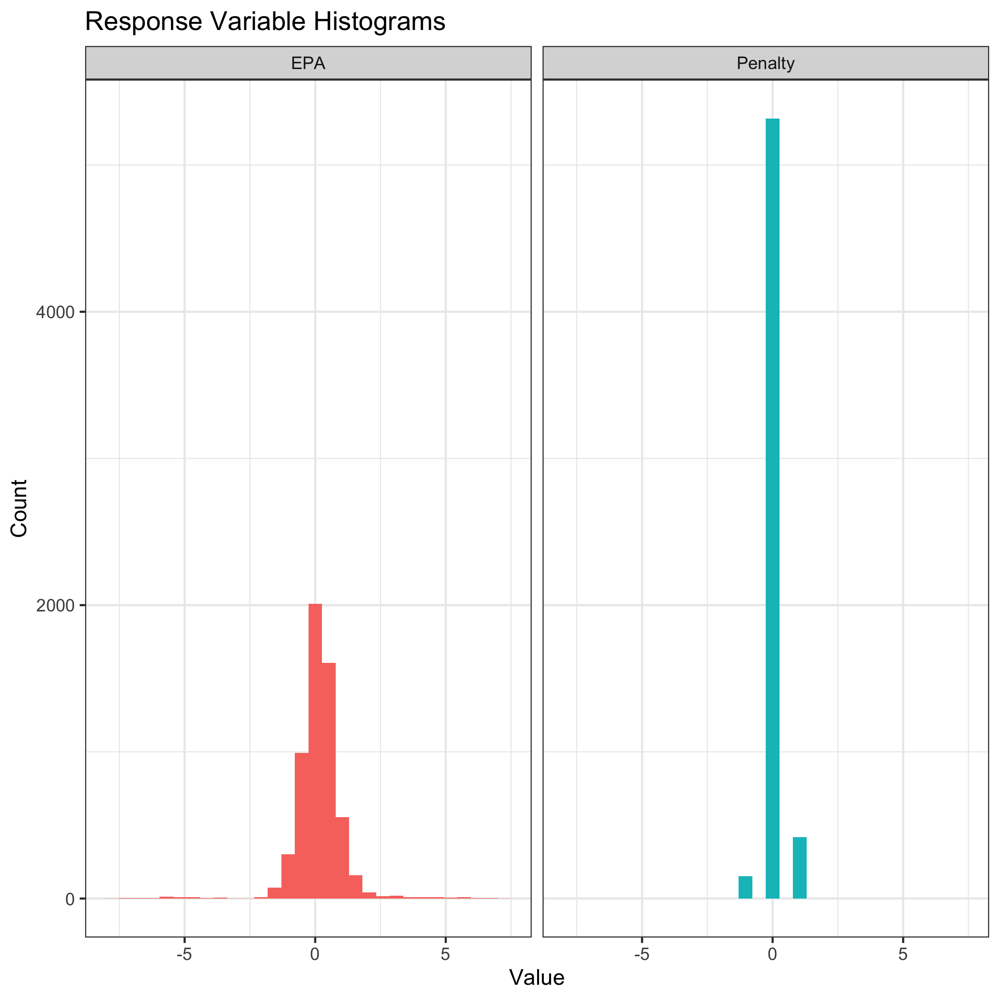
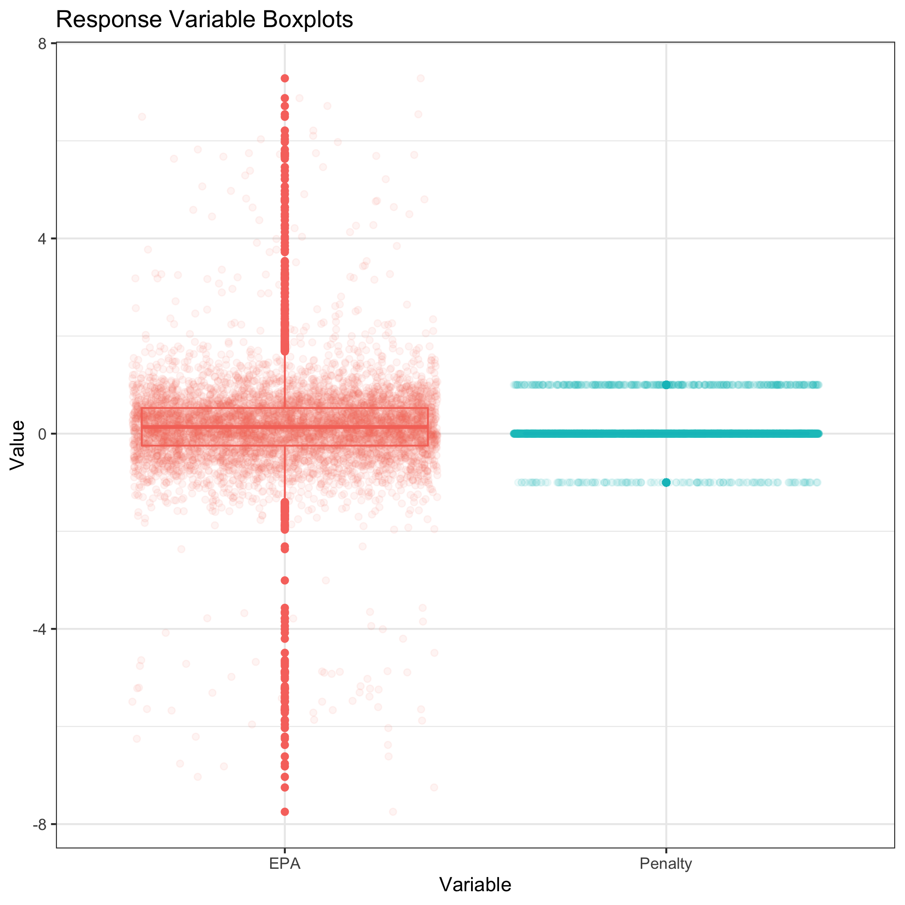

```{r setup, include=FALSE}
knitr::opts_chunk$set(echo = TRUE)
```

```{r, include=F}
library(knitr)
library(tidyverse)
library(Matrix)
library(gt)
library(gtExtras)
#we need to load in our dataframe to use for a few things this will be hidden though

Sparse.Df <- readMM("Derived_Data/Sparse.Matrix.txt")

punts <- read_csv("Derived_Data/clean.plays.csv")

player.index <- read_csv("Derived_Data/player.index.csv")

#first lets attach the unique newIds to the Sparse.Df as it's own column

#we need to convert the sparse matrix into a large data frame

Sparse.tib <- as.data.frame(as.matrix(Sparse.Df))

#now we can figure out which column corresponds to which player with the player.index

col.names <- player.index %>%
    arrange(ColIdx) %>%
    distinct(nflId, ColIdx) %>%
    select(nflId)

names(Sparse.tib) <- as.character(unlist(col.names))

Sparse.tib.named <- Sparse.tib %>% 
  mutate(newId = punts$newId) %>% 
  mutate(Pen.Yrds = punts$penalty.yards.clean) %>% 
  #here we use negative EPA since EPA is from the possession team perspective and I switched the variable of success 
  #to be from the return team perspective (-1 punters, 1 returners)
  mutate(EPA = -punts$epa) %>% 
  select(newId, EPA, Pen.Yrds, everything())
```


\pagebreak

\doublespacing

1. Abstract
-----------

2. Introduction
---------------

This paper introduces two new metrics for evaluating player performance during punting situations in the NFL: Regularized Adjusted Expected Points Added Contribution (RAEPAC) and Regularized Adjusted Penalty Yard Contribution (RAPYC). To build these new metrics, I adapt a statistic historically used in the NBA called Adjusted Plus-Minus (APM). This metric adjusts the conventional Plus-Minus metric to control for every player on the court during a stint where the same 10 players are on the court. In the NFL punt return case, this is simply the 22 players on the field during a punt. In classic APM for basketball, the variable of interest is the points scored during the stint, however this will not work for football since points are rarely scored during punts. In RAEPAC, I use Expected Points Added (EPA) as the variable of interest while in RAPYC I use penalty yards. EPA calculation is further explained in the Methodology section. Specifically, to calculate RAEPAC I use Ridge regression to to get regression coefficients for each player that was on the field during a punt. To calculate RAPYC, I use a Zero-Inflate Poisson regression to get coefficients for each player. These regression coefficients are what define these two new metrics. The model choices will be discussed further in the Methodology section. These metrics can be used to rank players regardless of their position on how much they positively contribute towards the success of their team on punting situations. These types of metrics could be extremely useful for on-field decision makers when deciding who should be on the field during crucial punting plays. Also, these metrics can be aggregated on a team level to rank how successful teams are during punts. Assessing players regardless of their position could change the way coaches think about their personnel and shed light on players that may not get enough credit for their contribution.

**2.1 Data**

The final dataframe used for analysis has 5890 plays with 2005 unique players. Each row of is a play from 2018-2020 where the team lined up to punt the ball away and each column is a player that could have been on the field. Each cell of the dataframe represents if the player was on the field during that play or not. A player on the punting team is given a -1 and each player on the receiving team is given a 1. Players that were not on the field during that play are coded as a 0. This follows the methodology first employed by Dan Rosenbaum for computing APM is basketball. 

This dataframe is inherently rank deficient and therefore I cannot use standard linear regression, rather I use a penalized approach so the sample covariance matrix was invertible. The dataframe is rank deficient because if I remove a players column, I still know whether he was on the field on offense or defense by simply using the rest of the columns. According to this, the matrix does not have full rank. Below is a glimpse of the dataframe.

```{r, echo = F}
head(Sparse.tib.named %>% 
       rename(PlayId = newId) %>% 
       select(1:10)) %>% 
  gt()
```


3. Methodology
--------------

In this section I discuss the EPA variable calculation, Exploratory Data Analysis (EDA), and model selection process. I use a similar methodology as explained in Dan Rosenbaums's 2004 paper titled "Measuring How NBA Players Help Their Teams Win". 

**3.1 EPA Calculation**

EPA is calculated by taking the difference between the expected points before and after the play occurs. Using historical data, the amount of points a team is expected to score on the current drive depending on the down, distance to the first down, and field position can be calculated. Expected points is based off the notion that not all yards gained are the same. For example, a 2-yard gain on 4th down and 3 does not increase a teams chance of scoring, while a 2-yard gain on 4th and 1 does because the offense will remain on the field. Expected points quantifies this difference by relating each play to how much it changes the chances of scoring on that drive. Figure 1 shows how expected points changes as a team drives down the field towards the opponents end zone. 

```{r, echo = F, out.height = "35%", fig.cap = "This plot shows how expected points changes depending on the down and distance to the end zone. As shown, it is far better to be closer to the end zone on early downs.", fig.pos = "H", fig.show='hold', fig.align='center'}

```

As can be seen, expected points increases as the team moves closer and closer to the end zone. Also, the down has a significant impact on the expected points as 1st down will always be higher than 4th. When expected points is negative, this means the opponent is more likely to score on the next drive because the team currently in possession is likely to punt. This situation occurs when a team is near their own end zone. EPA shows how much the expected points changed because of the play that happened. When EPA is positive the play is deemed successful for the offense. I'll use EPA, calculated by the nflfastR play-by-play database, as my main response variable because it directly reflects the success of the play in terms of expected points scored in the next drive. The punting team will want this variable to be as negative as possible, while the return team will try to increase it to nearly 7. 

**3.2 Exploratory Data Analysis**

I complete a preliminary EDA to validate and visualize the data before the modeling procedures. Completing and EDA prior to modeling is a crucial step that ensures the data are correct and the model choices are valid. I begin by making certain the final dataframe is correct. To complete this I first check that each row sums to 0 to show there are the same amount of offensive and defensive players on the field. I then check to see that there are always 22 players on the field. Finally, I choose 500 random plays and check to make sure the correct players are on the field. After validating the final dataframe I move on the visualization. 

I begin by visualizing the response variables: EPA and penalty yards. This step helps me to decide what kind of models are appropriate for these responses. Below I plot the histograms of the two variables. 

```{r, echo = F, out.height = "45%", fig.cap = "This plot shows the distribution of the two response variables. It seems the EPA response is approximately normal around 0. On the other hand the penalty yards response has a large amount of 0s.", fig.pos = "H", fig.show='hold', fig.align='center'}

```

As seen in Figure 2, there seems to be an inflated amount of 0s in both distributions. Penalty yards is a discrete variable and there are many plays that do not have any penalties and thus have a value of 0. On the other hand, EPA is a continuous variable and many of the values are close to 0, indicating that the punt leads to neither team gaining an advantage. Punts that result in a fumble and the punting team recovering the ball result in a very negative EPA meaning the punting team was extremely successful and is now likely to score. Similarly, punts that result in a huge return have a high EPA close to 7 that shows the return team was successful. In Figure 3, I show box-plots of the response variables to reinforce these findings. 

```{r, echo = F, out.height = "50%", fig.cap = "These box-plots help reinfroce what is seen in Figure 2. The mean for both response variables is right around 0 and EPA seems approximately normal.", fig.pos = "H", fig.show='hold', fig.align='center'}

```

4. Results
----------

5. Conclusion & Future Research
-------------------------------

6. Appendix
-----------

7. References
-------------

Dan Rosenbaum's Paper: http://www.82games.com/comm30.htm

Figure 1: https://www.nfeloapp.com/analysis/expected-points-added-epa-nfl