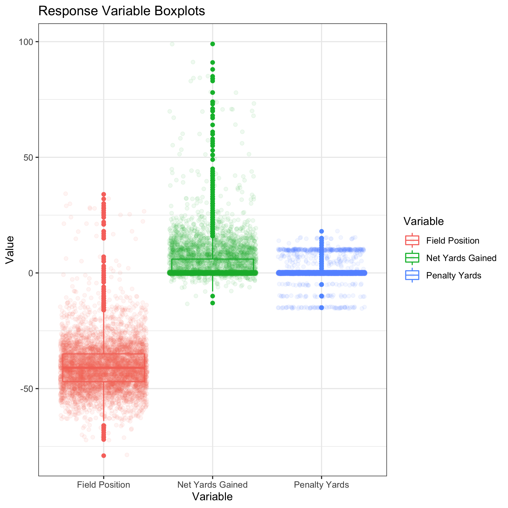
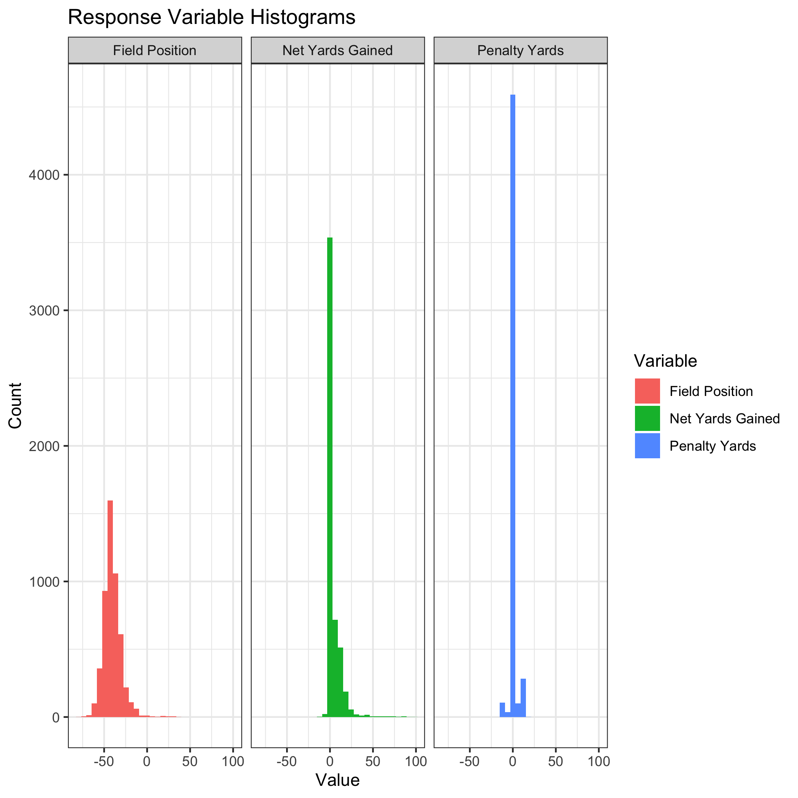
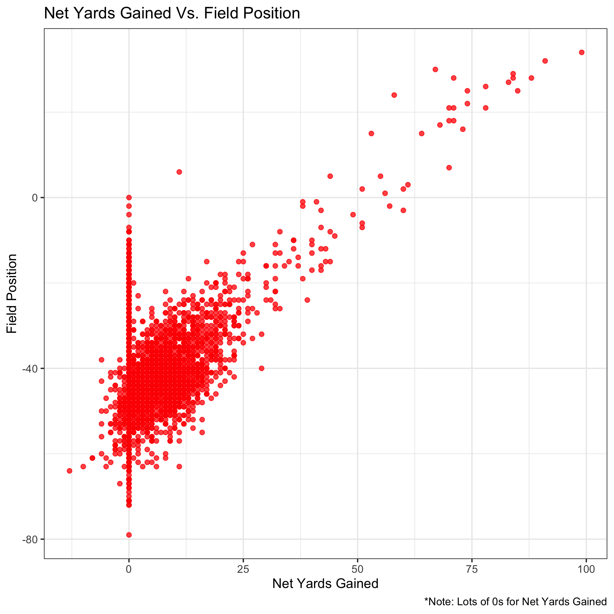
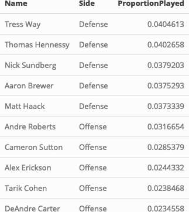
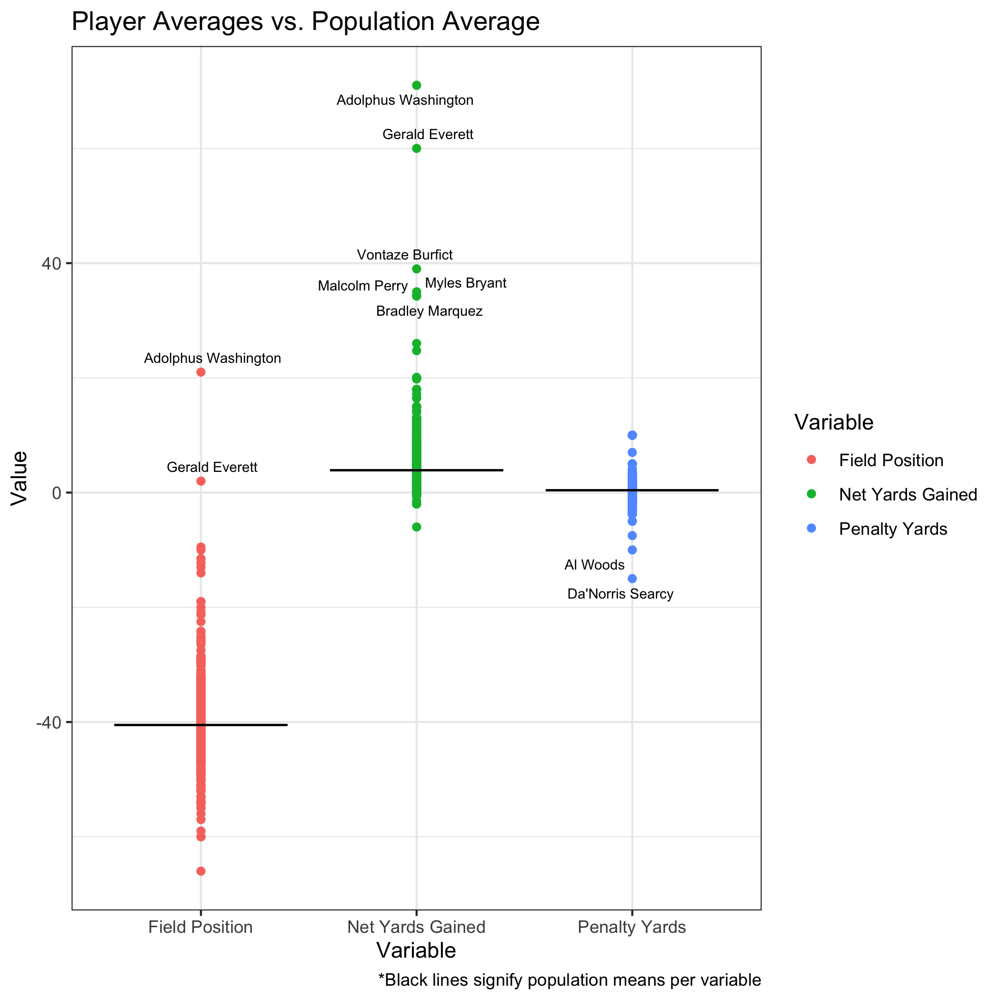

2022 NFL Big Data Bowl
----------------------

## Adjusted Plus-Minus Net Return Yards Gained

## Usage

You'll need to install Docker [Here](https://www.docker.com/).

Once you've downloaded Docker you'll need to build the container. Think of the container as a virtual environment that already has every package you'll need downloaded. To build the environment open a terminal and find the directory this project is in. Then run the following command:

     docker build . -t 2022-NFL-BDB-env
    
This will likely take some time as many packages need to be downloaded.

After the build is complete, you wil be able to open an rstudio server in a browser inside the container. This Docker container is based on rocker/verse. To run the rstudio server run the following command in the terminal:

     docker run -v `pwd`:/home/rstudio -p 8787:8787 -e PASSWORD=mypass -t 2022-NFL-BDB-env
      
Then click [Here](http://0.0.0.0:8787/). **Right-Click and Open in New Tab**. This will bring up an rstudio server to build artifacts, explore data, and continue my work. 

Username: rstudio \
Password: mypass

#### Make
Use Makefile as recipe book for building artifacts found in derived directories. 

##### Example:
In the virtual rstudio environment, to build artifact named Analysis.pdf go to the terminal and use the following command:

     make Analysis.pdf
    
Use artifacts before colon as make targets. Dependencies are listed after colon.

### Data

Data can be found [Here](https://www.kaggle.com/c/nfl-big-data-bowl-2022/data). You'll need to unzip the data and place the files directly into the Source_Data directory. 

### Abstract

### Introduction

### Preliminary Figures from EDA

Here are the boxplots for the three response variables. As you can see, there are a lot of 0s in the Net Yards Gained and Penalty Yards variables. Net Yards Gained has lots of 0s due to the touchbacks, downed balls, and fair catches. This leads us to believe a zero-inflate poisson model may be well suited for these two variables. From the field position boxplot, we suspect it may be approximately normally distributed. 

Below we can see that are suspicion about the field position was verified. It seems to follow an approximately normal distribution with a mean around -40. 

Now we see Net Yards Gained plotted against Field Position. There is a clear positive trend after we disregard the inflated 0s in net yards gained.

Rather than visualizing the sparse matrix, we attempt to summarize the structure of it. Since the matrix is very large it is difficult to visualize in the typical manner using a heatmap. Our final matrix displays 5116 plays with 1993 unique players. 

Below we see the top 5 players on offense and defense for their proportion of time on the field for these 5116 plays. It is not surprising to see Andre Roberts, Alex Erickson, Tarik Cohen, and DeAndre Carter on the top 5 as they are all punt return specialists. Similarly on the defensive side, we see 2 punters (Tress Way & Matt Haack) and 3 long snappers (Thomas Hennessy, Nick Sundberg, & Aaron Brewer).

Next, we'll take a look at the difference between individual players averages across the three responses and the population averages. We then label players that are above or below 3 standard deviations away from the population mean. We find two players with very high field position and net yards gained. Adolphus Washington and Gerald Everett were both on the field during a single play that happened to be a major return. We will likely remove these kinds of players with low sample sizes because their contribution cannot be defined by a single play. 

