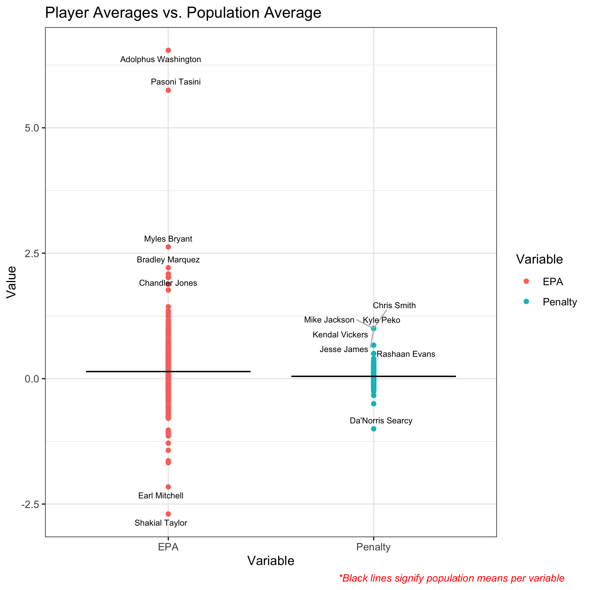

2022 NFL Big Data Bowl
----------------------

## Adjusted Plus-Minus Net Return Yards Gained

## Usage

You'll need to install Docker [Here](https://www.docker.com/).

Once you've downloaded Docker you'll need to build the container. Think of the container as a virtual environment that already has every package you'll need downloaded. To build the environment open a terminal and find the directory this project is in. Then run the following command:

     docker build . -t 2022-NFL-BDB-env
    
This will likely take some time as many packages need to be downloaded.

After the build is complete, you wil be able to open an rstudio server in a browser inside the container. This Docker container is based on rocker/verse. To run the rstudio server run the following command in the terminal:

     docker run -v `pwd`:/home/rstudio -p 8787:8787 -e PASSWORD=mypass -t 2022-NFL-BDB-env
      
Then click [Here](http://0.0.0.0:8787/). **Right-Click and Open in New Tab**. This will bring up an rstudio server to build artifacts, explore data, and continue my work. 

Username: rstudio \
Password: mypass

#### Make
Use Makefile as recipe book for building artifacts found in derived directories. 

##### Example:
In the virtual rstudio environment, to build artifact named Analysis.pdf go to the terminal and use the following command:

     make Analysis.pdf
    
Use artifacts before colon as make targets. Dependencies are listed after colon.

### Data

Data can be found [Here](https://www.kaggle.com/c/nfl-big-data-bowl-2022/data). You'll need to unzip the data and place the files directly into the Source_Data directory. 

### Abstract

### Introduction

This paper introduces three new metrics for assessing player contribution during a punt. We adapt a metric historically used in basketball called Adjusted Plus-Minus (APM); this metric adjusts the conventional Plus-Minus metric to control for every player on the court during a stint where the same 10 players are on the court. In the NFL punt return case, this is simply the 22 players on the field during a punt. In classic APM for basketball, the variable of interest is the points scored during the stint, this will not work for football as points are rarely scored during punts. Instead, we will build 2 different metrics for different variables that represent success during a punt return. The first is the the difference between the expected points before and after the play historically known as EPA. We will discuss EPA calculation in the Methodology section. The second is the penalty yards assessed on the punt. These new metrics can be used to rank players regardless of their position on how much they positively contribute towards the success of their team in punting situations. The definition of contribution will be discussed later, but for now it is a positive number indicating how much that individual helped their team.

### Preliminary Figures from EDA

Here are the boxplots for the three response variables. As you can see, the EPA response seems approximately normally distributed around 0. On the other hand, there are a lot of 0s in the  Penalty Yards response. This leads us to believe a zero-inflate poisson model may be well suited for this variable. 

Below we can see that are suspicion about the EPA was verified. It seems to follow an approximately normal distribution with a mean around 0. 

In the table below we see the top 5 players on punt and return teams for their proportion of time on the field for these 5890 plays. It is not surprising to see Andre Roberts, Alex Erickson, Tarik Cohen, and DeAndre Carter on the top 5 as they are all punt return specialists. Similarly on the defensive side, we see 2 punters (Tress Way & Matt Haack) and 3 long snappers (Thomas Hennessy, Casey Kreiter, & Aaron Brewer).

Next, we'll take a look at the difference between individual player's averages across the three responses while they are on the field and the population averages. We then label players that are above or below 2 standard deviations away from the population mean. We find one player with very high EPA. Adolphus Washington is only on the field during a single play that happened to be a major return. We will likely remove these kinds of players with low snap counts because their contribution cannot be defined by a single play. 

